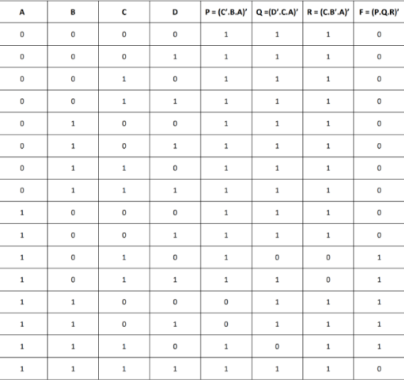
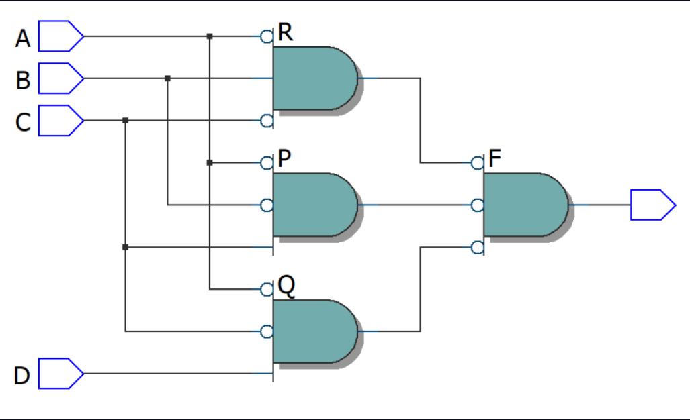
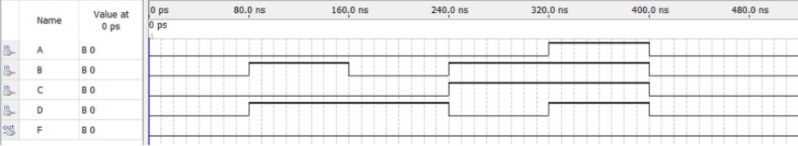
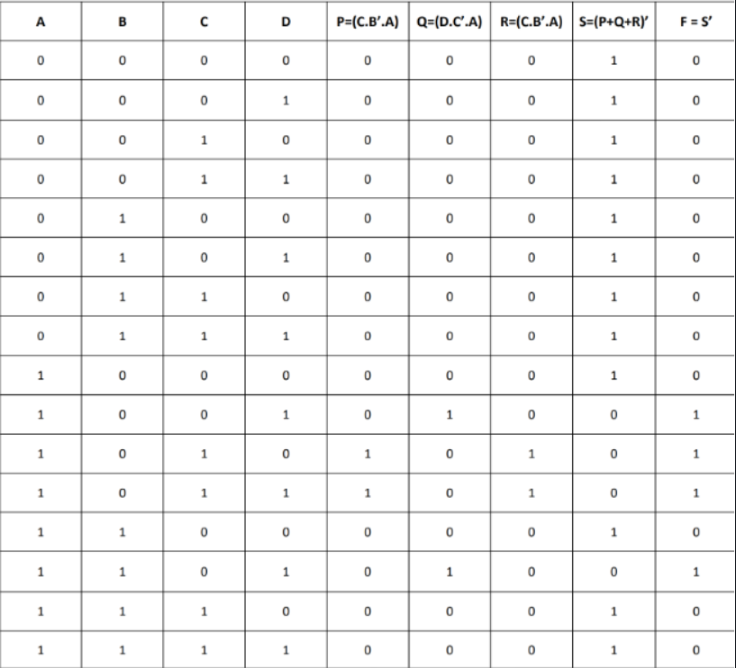
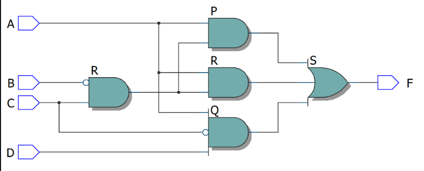
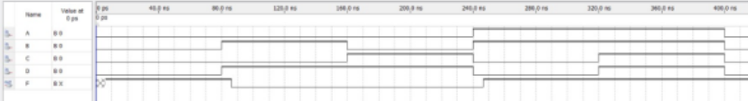

# Experiment--04-Implementation-of-combinational-logic-using-universal-gates-
 ## Implementation-of-Half-subtractor-and-Full-subtractor-circuit
## AIM:
To implement the given logic function using NAND and NOR gates and to verify its operation in Quartus using Verilog programming.
F=((C'.B.A)'(D'.C.A)'(C.B'.A)')' using NAND gate
F=(((C.B'.A)+(D.C'.A)+(C.B'.A))')' using NOR gate


## Equipments Required:
Hardware – PCs, Cyclone II , USB flasher Software – Quartus prime

## Theory
 NAND and NOR gates are known as universal gates. They are called universal gates because they can perform all logic functions of OR, AND, and NOT gates.
 


## Procedure
Step 1:

Open Quartus II and select new project and choose the file location.

Step 2:

Module Declaration. Module should have the file name.

Step 3:

Input-Output Delecaration. F=((C'.B.A)'(D'.C.A)'(C.B'.A)')' using NAND gate F=(((C.B'.A)+(D.C'.A)+(C.B'.A))')' using NOR gate.

Step 4:

Use assign declaration and wire to define the functionality of logic circuits.

Step 5:

At the end give endmodule.

Step 6:

Run the program and choose RTL viewer to get RTL realization.


## Program:


```
Program to design a Implementation of combinational logic using universal gates-  and verify its truth table in quartus using Verilog programming.
Developed by: VISHAL GOWTHAMAN K R
RegisterNumber:  212221230123


F=((C'.B.A)'(D'.C.A)'(C.B'.A)')' using NAND gate:

code:

module Combination(A,B,C,D,F);
input A,B,C,D;
output F;
wire P,Q,R;
assign P = C&(~B)&(~A);
assign Q = D&(~C)&(~A);
assign R = (~C)&B&(~A);
assign F = (~P&~Q&~R);
endmodule

F=(((C.B'.A)+(D.C'.A)+(C.B'.A))')' using NOR gate:

code:

module norcombination(A,B,C,D,F);
input A,B,C,D;
output F;
wire P,Q,R,S;
assign P = C&(~B)&A;
assign Q = D&(~C)&A;
assign R = C&(~B)&A;
assign S = ~(P|Q|R);
not(F,S);
endmodule


```

## Output:

NAND GATE:
## Truthtable


##  RTL realization


## Timing diagram 


NOR GATE:-

## Truthtable


##  RTL realization


## Timing diagram 



## Result:
 
Thus implementation of logic functions using NAND and NOR gates is done and its operation is verified in Quartus using Verilog programming.
